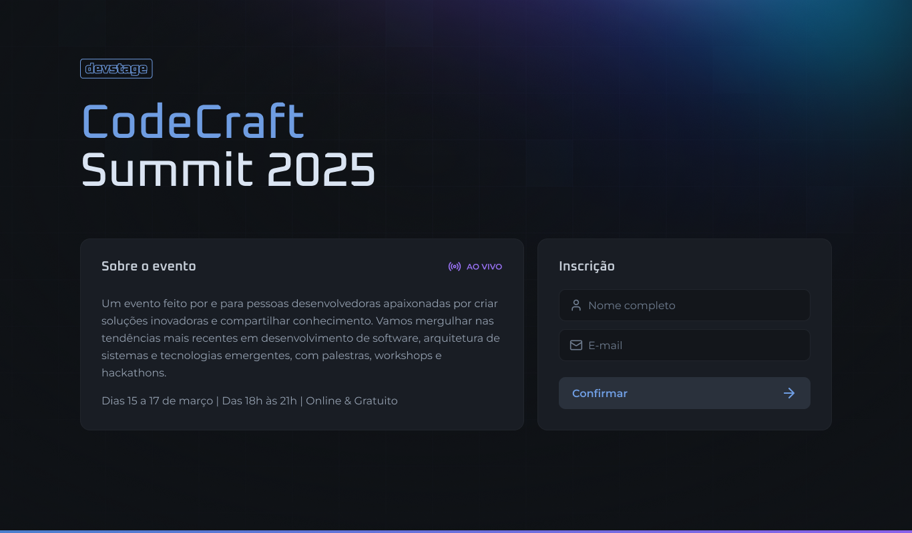
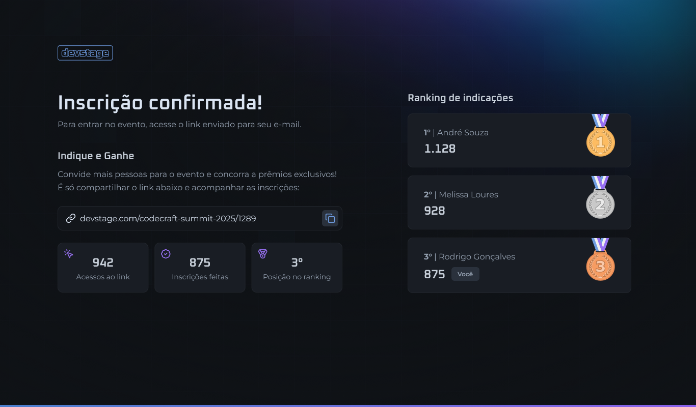

# Dev Stage Web

<p align="center">
  <a href="#-tecnologias">Tecnologias</a>&nbsp;&nbsp;&nbsp;|&nbsp;&nbsp;&nbsp;
  <a href="#-projeto">Projeto</a>&nbsp;&nbsp;&nbsp;|&nbsp;&nbsp;&nbsp;
  <a href="#-clonando-o-projeto-para-sua-máquina">Clonar</a>
</p>

<p align="center">
  
  
</p>

---

## 🚀 Objetivo do Projeto

O **Dev Stage Web** é um site responsivo para criação e indicação de eventos. O objetivo principal é fornecer uma interface intuitiva e dinâmica para que os usuários possam gerenciar eventos de forma eficiente.

### ✨ Funcionalidades Principais

- **Criação de Eventos**: Permite aos usuários criar eventos personalizados.
- **Indicação de Eventos**: Compartilhamento e recomendação de eventos.
- **Design Responsivo**: Totalmente adaptado para dispositivos móveis e desktops.
- **Integração com API**: Uso de **Orval** para geração de clientes de API a partir do OpenAPI.

---

## 🛠 Tecnologias Utilizadas

Este projeto foi desenvolvido utilizando as seguintes tecnologias:

- [Next.js](https://nextjs.org/)
- [TypeScript](https://www.typescriptlang.org/)
- [TailwindCSS v4](https://tailwindcss.com/)
- [React Hook Form](https://react-hook-form.com/)
- [Zod](https://zod.dev/)
- [Orval](https://orval.dev/)

---

## 🔗 API

A API utilizada no projeto pode ser acessada aqui: [**devStage**](https://github.com/marlisonmourao/nlw-connect.git).

---

## 💻 Clonando o Projeto

Para clonar e rodar o projeto localmente, siga os passos abaixo:

```bash
# Clone o repositório
$ git clone https://github.com/marlisonmourao/nlw-connect.git

# Acesse a pasta do projeto
$ cd nlw-connect

# Instale as dependências
$ npm install # ou npm i
# Ou, se estiver utilizando pnpm:
$ pnpm install # ou pnpm i

# Abra o projeto no VS Code
$ code .
```

Agora, o projeto está pronto para ser testado e modificado conforme sua necessidade.

---

<p align="center">
  
</p>

---

<p align="center">Made with 💜 by <a href="https://github.com/marlisonmourao">Marlison Mourão</a></p>

